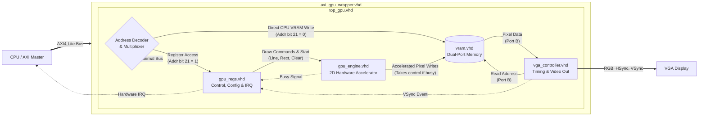

# GlandaGPU Hardware Specification

This document provides the hardware specifications for the GlandaGPU, designed for Linux device driver development. The GPU is interfaced via an AXI4-Lite bus (32-bit data, 32-bit address).

## 1. Memory Map
The device address space is divided into two main regions, determined by bit 21 of the AXI address (`0x200000`).

| Region   | Base Address | Size     | Description                            |
| :------- | :----------- | :------- | :------------------------------------- |
| **VRAM** | `0x000000`   | ~1.17 MB | Direct access to Video RAM.            |
| **MMIO** | `0x200000`   | 32 Bytes | Hardware control and status registers. |

_Note: CPU access to VRAM is stalled (via AXI wait states) if the 2D GPU engine is currently busy executing a command._

---
## 2. Register Map (MMIO)
All registers are 32-bit wide and must be accessed via 32-bit aligned reads/writes. The base address for these registers is `0x200000`.

| Offset | Name     | Access | Description                                  |
| :----- | :------- | :----- | :------------------------------------------- |
| `0x00` | `STATUS` | RO     | Hardware Status                              |
| `0x04` | `CTRL`   | R/W    | Engine Control & Command                     |
| `0x08` | `COORD0` | R/W    | Coordinate 0 (X0, Y0)                        |
| `0x0C` | `COORD1` | R/W    | Coordinate 1 (X1/W, Y1/H)                    |
| `0x10` | `COLOR`  | R/W    | Fill/Draw Color                              |
| `0x14` | `ISR`    | R/W1C  | Interrupt Status Register (Write 1 to Clear) |
| `0x18` | `IER`    | R/W    | Interrupt Enable Register                    |
### Register Bitfields
**`0x00` - STATUS**
- `Bit 0`: **BUSY** - `1` if the 2D engine is currently executing a command.
- `Bit 1`: **VSYNC** - Current state of the VGA VSync signal.

**`0x04` - CTRL**
- `Bits 3:0`: **CMD** - Command to execute (see Section 3).
- `Bit 4`: **START** - Write 1 to trigger the command execution. Writing a 1 generates a single-cycle internal pulse to start the GPU engine.
Note: The register value does not auto-clear on readback. Do not poll this bit to check for command completion; poll the BUSY bit in the STATUS register (0x00) instead. You do not need to manually write a 0 to this bit before starting a new command.

**`0x08` - COORD0**
- `Bits 9:0`: **X0** - Starting X coordinate.
- `Bits 25:16`: **Y0** - Starting Y coordinate.

**`0x0C` - COORD1**
- `Bits 9:0`: **X1 / W** - Ending X coordinate (for lines) or Width (for rects).
- `Bits 25:16`: **Y1 / H** - Ending Y coordinate (for lines) or Height (for rects).

**`0x10` - COLOR**
- `Bits 11:0`: **RGB** - 12-bit color value (Bits 11:8 Red, 7:4 Green, 3:0 Blue).

**`0x14` - ISR (Interrupt Status)**
- `Bit 0`: **DONE_INT** - Set to `1` on the falling edge of the engine BUSY signal.
- `Bit 1`: **VSYNC_INT** - Set to `1` on the falling edge of the VSYNC signal.
- _Note: Write `1` to the respective bit to clear the interrupt._

**`0x18` - IER (Interrupt Enable)**
- `Bit 0`: **DONE_EN** - Write `1` to enable the Engine Done interrupt.
- `Bit 1`: **VSYNC_EN** - Write `1` to enable the VSync interrupt.

---
## 3. 2D Engine Commands
To submit a command, populate the required registers (`COORD0`, `COORD1`, `COLOR`), and then write the Command ID and the `START` bit (`0x10`) to the `CTRL` register simultaneously.
  
| CMD ID | Operation          | Required Registers          | Description                                                         |
| :----- | :----------------- | :-------------------------- | :------------------------------------------------------------------ |
| `0x1`  | **Clear Screen**   | `COLOR`                     | Fills the entire 640x480 VRAM with `COLOR`.                         |
| `0x2`  | **Draw Rectangle** | `COORD0`, `COORD1`, `COLOR` | Draws a filled rectangle at `X0, Y0` with width `W` and height `H`. |
| `0x3`  | **Draw Line**      | `COORD0`, `COORD1`, `COLOR` | Draws a line from `X0, Y0` to `X1, Y1` using Bresenham's algorithm. |

**Example: Draw a Yellow Rectangle**
1. Write `0x00320032` to `COORD0` (X0=50, Y0=50)
2. Write `0x006400C8` to `COORD1` (W=200, H=100)
3. Write `0x00000FF0` to `COLOR` (Yellow)
4. Write `0x00000012` to `CTRL` (CMD=2, START=1)

---
## 4. Interrupts
The GPU exposes a single `irq` line to the system.
- The IRQ line is asserted high when `(ISR & IER) != 0`.
- The driver should read the `ISR` (`0x14`) to determine the cause of the interrupt.
- The driver must acknowledge the interrupt by writing the read value back to the `ISR` (Write-1-to-Clear).

---
## 5. Display Controller & VRAM
### Display Timing
- **Resolution:** 640 x 480
- **Refresh Rate:** 60 Hz
- **Pixel Clock:** 25 MHz
- The display controller reads continuously from VRAM. No configuration is required to enable the display output.
### VRAM Layout
- **Base Address:** `0x000000`
- **Size:** 307,200 pixels (640 * 480).
- **Addressing:** Linear framebuffer. Each pixel occupies a 32-bit word on the AXI bus, though only the lower 12 bits are used.
- **Pixel Offset Calculation:** `Byte_Address = (Y * 640 + X) * 4`
- **Pixel Format (XRGB 4-4-4):**
    - Bits 31:12 - Ignored / Read as 0
    - Bits 11:8 - Red
    - Bits 7:4 - Green
    - Bits 3:0 - Blue