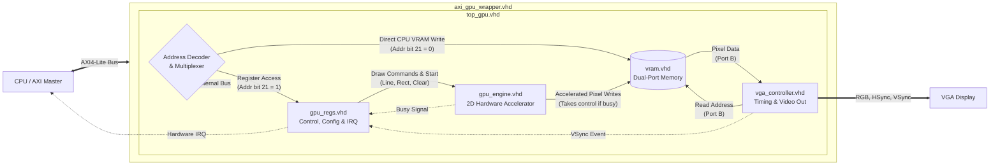

# GlandaGPU v0.2

This Simple GPU is a memory-mapped 2D acceleration core. It handles VGA signal generation and provides hardware acceleration for basic geometric primitives.

## Hardware Parameters
| Parameter | Value | Description |
| :--- | :--- | :--- |
| **Resolution** | 640 x 480 | Industry standard VGA |
| **Refresh Rate**| 60 Hz | 25.175 MHz Pixel Clock |
| **Color Depth** | 12-bit (4-4-4) | Stored as 32-bit words (0x...0RGB) |

## Architecture

The GlandaGPU connects to the host system via an AXI4-Lite bus. It is composed of three main blocks:
1.  **VGA Controller:** Reads from VRAM and generates the video timing signals.
2.  **2D Command Engine:** A hardware accelerator that performs fast drawing operations (Fill, Rect, Line) directly into VRAM, relieving the CPU.
3.  **Register Interface:** Allows the driver to configure the GPU and trigger commands.

## Current Test Pattern Generated by the GPU

## The First Generated Frame of the GPU

## Documentation

For detailed register maps, memory layouts, and programming guidelines, please refer to the [Hardware Specification](Hardware_Specification.md).

## Roadmap & Next Steps

The hardware design (VHDL) for the VGA controller and the 2D acceleration engine is functional and can generate test frames.

The immediate next step is **writing a Linux device driver**. To facilitate this without requiring physical hardware for every iteration, the plan includes:

1.  **Simple Linux Driver:** Create a basic platform driver to map memory and verify register access.
2.  **QEMU Device Model:** Implement a software emulation of the GlandaGPU in QEMU to test the driver in a virtual environment.
3.  **DRM/KMS Driver:** Expand the driver to support the Linux Direct Rendering Manager (DRM) subsystem.
4.  **FPGA Verification:** Validate the VHDL and driver on physical FPGA hardware (currently only simulated).
