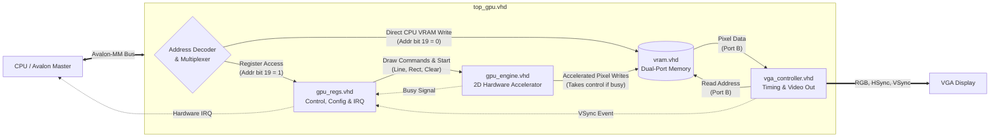

# GlandaGPU v0.5

This Simple GPU is a memory-mapped 2D acceleration core. It handles VGA signal generation and provides hardware acceleration for basic geometric primitives.

  <a href="https://www.youtube.com/watch?v=9Oxhgr2rtWc">
    
     
    ▶ Watch Video
  </a>

## Software & Ecosystem

The GlandaGPU project also includes software components used for development and testing:

### Linux Device Driver

A fork of the Linux kernel containing the GlandaGPU platform / DRM driver implementation.  
[Linux Device Driver](https://github.com/stiangglanda/linux/tree/master/drivers/gpu/drm/glandagpu)

### QEMU Device Model

A fork of QEMU implementing a virtual GlandaGPU device. This allows the driver to be developed and tested without FPGA hardware.  
 [qemu-glandagpu](https://github.com/stiangglanda/qemu-glandagpu/blob/master/hw/display/glandagpu.c)

The QEMU device model acts as a **software twin of the hardware**, enabling rapid driver development and debugging in a fully virtualized environment.

## Hardware Parameters

| Parameter        | Value          | Description                                                            |
| :--------------- | :------------- | :--------------------------------------------------------------------- |
| **Resolution**   | 640 x 480      | Industry standard VGA                                                  |
| **Refresh Rate** | 60 Hz          | 25.175 MHz Pixel Clock                                                 |
| **Color Depth**  | 12-bit (4-4-4) | Physically stored as 12-bit and Accessed as 32-bit words via Avalon-MM |

## Architecture

The GlandaGPU connects to the ARM host system via an Avalon Memory-Mapped (Avalon-MM) bus, physically mapped at base address `0x40000000`. It is composed of three main blocks:

1.  **VGA Controller:** Reads from VRAM and generates the video timing signals.
2.  **2D Command Engine:** A hardware accelerator that performs fast drawing operations (Fill, Rect, Line) directly into VRAM, relieving the CPU.
3.  **Register Interface:** Allows the driver to configure the GPU and trigger commands.

```mermaid
graph LR
    %% External Entities
    CPU[CPU / Avalon Master]
    Monitor[VGA Display]

    subgraph Avalon_GPU_Wrapper [top_gpu.vhd]
        direction TB

        BusMux{Address Decoder<br>& Multiplexer}

        REGS[gpu_regs.vhd<br>Control, Config & IRQ]
        ENGINE[gpu_engine.vhd<br>2D Hardware Accelerator]
        VRAM[(vram.vhd<br>Dual-Port Memory)]
        VGA[vga_controller.vhd<br>Timing & Video Out]

        %% Internal Connections
        BusMux -- "Register Access<br>(Addr bit 19 = 1)" --> REGS
        BusMux -- "Direct CPU VRAM Write<br>(Addr bit 19 = 0)" --> VRAM

            REGS -- "Draw Commands & Start<br>(Line, Rect, Clear)" --> ENGINE
            ENGINE -- "Accelerated Pixel Writes<br>(Takes control if busy)" --> VRAM
            ENGINE -. "Busy Signal" .-> REGS

            VGA -- "Read Address<br>(Port B)" --> VRAM
            VRAM -- "Pixel Data<br>(Port B)" --> VGA

            VGA -. "VSync Event" .-> REGS
    end

    %% External Connections
    CPU <==>|Avalon-MM Bus| Avalon_GPU_Wrapper
    REGS -. "Hardware IRQ" .-> CPU
    VGA ===>|RGB, HSync, VSync| Monitor
```

## Current Test Pattern Generated by the GPU

## The First Generated Frame of the GPU

## Documentation

For detailed register maps, memory layouts, and programming guidelines, please refer to the [Hardware Specification](doc/Hardware_Specification.md).

## Roadmap & Next Steps

The hardware design (VHDL) for the VGA controller and the 2D acceleration engine is functional and can generate test frames.

The immediate next step is **writing a Linux device driver**. To facilitate this without requiring physical hardware for every iteration, the plan includes:

- [x] **Simple Linux Driver:** Create a basic platform driver to map memory and verify register access.
- [x] **QEMU Device Model:** Implement a software emulation of the GlandaGPU in QEMU to test the driver in a virtual environment.
- [ ] **DRM/KMS Driver:** Expand the driver to support the Linux Direct Rendering Manager (DRM) subsystem.
- [x] **FPGA Verification:** Validate the VHDL and driver on physical FPGA hardware (currently only simulated).
